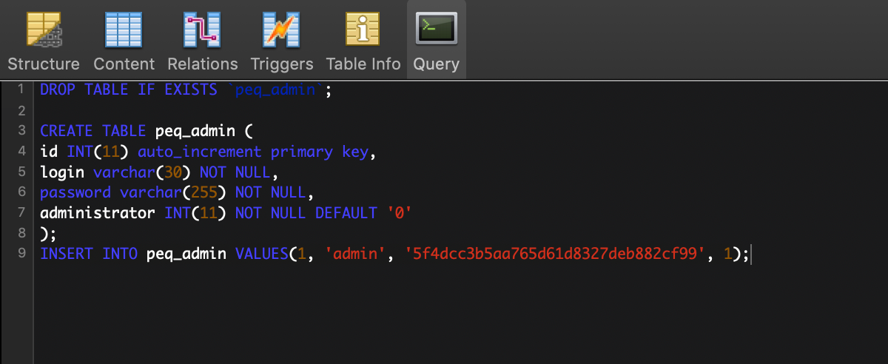
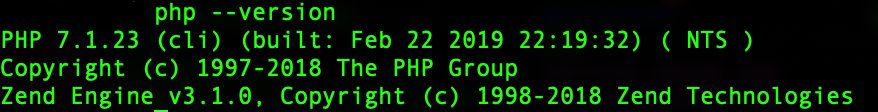

# Install PEQ Database Editor


For the vast majority of users, simply use the publicly available version of the PEQ Database Editor found at [eoc.akkadius.com](http://eoc.akkadius.com/).  Input the settings for you server on the [Login](http://eoc.akkadius.com/EOC2/login.php) page and be sure to follow the on-screen instructions.


## Unix-like System Installation Instructions

These instructions are intended to be used on a freshly installed server.  Some services may have been enabled on your server when the provider installed the image.  You should still be able to reference these steps to configure your server.

### CentOS 7

Enable the appropriate MySQL Repo.

```text
yum localinstall https://dev.mysql.com/get/mysql57-community-release-el7-11.noarch.rpm
```

Install MySQL.

```text
yum install mysql-community-server
```

Open the MySQL configuration file for edits.

```text
nano /etc/my.cnf
```

Configure MySQL to list on all IPv4 addresses by adding the following lines to your configuration file.  Save your edits.

```text
# Bind Address
bind-address=0.0.0.0
```

Enable the MySQL server executable to run on startup.

```text
systemctl enable mysqld
```

Start the MySQL server.

```text
systemctl start mysqld
```

Verify that all went well by checking your MySQL version.

```text
mysql --version
```

Enable the web server executable to run on startup.

```text
systemctl enable httpd.service
```

Start the web server.

```text
systemctl start httpd.service
```

Install the Yum Utilities package.

```text
yum install yum-utils –y
```

Install Extra Packages for Enterprise Linux.

```text
yum install epel-release –y
```

Set your configuration parameters to use PHP7+.

```text
yum-config-manager --enable remi-php71
```

Install PHP packages.

```text
yum install php php-common php-opcache php-mcrypt php-cli php-gd php-curl php-mysql
```

Locate your loaded PHP configuration file.

```text
php -i | grep "Loaded Configuration File"
```

Open your PHP configuration file for editing \(using the path indicated in the previous step\).

```text
nano [path]php.ini
```

Use the find command \(ctrl+w\) to locate the configuration parameter for short open tags.

```text
# Set short_open_tag to ON
short_open_tag = On
```

Navigate to the directory where you want to install the PEQ Database Editor and clone the GitHub Repository \(IE /var/www/html\).

```text
git clone https://github.com/ProjectEQ/peqphpeditor.git
```

Navigate to the main PEQ directory and create a copy of the PEQ Database Editor configuration file.

```text
mv config.php.dist config.php
```

Edit the configuration file and input your settings.

```text
nano config.php
```

Navigate to the sql directory.  The files that you find in this directory contain queries that you will need to run on your database prior to using the PEQ Database Editor.  You can open these files and then copy / paste the queries into your database editing client.

```text
nano schema.sql
```



Repeat this process for any remaining files in the sql directory.

Point your web browser to the index.php file and login.  The default username / password are "admin", and "password".

### MacOS

Install Xcode.

* Click the Apple Icon in the upper-left corner of your screen⋅⋅
* Choose App Store...
* Search for Xcode
* Install Xcode

Install Command line tools for Xcode.

```text
xcode-select --install
```

Install Homebrew.

```text
/usr/bin/ruby -e "$(curl -fsSL https://raw.githubusercontent.com/Homebrew/install/master/install)"
```

Install MySQL \(v5.7\)

```text
brew install mysql@5.7
```

Install PHP \(v7.1\)

```text
brew install php@7.1
```

Verify that the appropriate version is running.

```text
php --version
```



Locate your loaded PHP configuration file.

```text
php -i | grep "Loaded Configuration File"
```

Open your PHP configuration file at the path indicated in the prior step.

```text
nano /etc/php.ini
```

Use the find command \(ctrl+w\) to locate the configuration parameter for short open tags.

```text
# Set short_open_tag to ON
short_open_tag = On
```

Navigate to the directory where you want to install the PEQ Database Editor and clone the GitHub Repository \(IE /Library/WebServer/Documents/\).

```text
git clone https://github.com/ProjectEQ/peqphpeditor.git
```

Navigate to the main PEQ directory and create a copy of the PEQ Database Editor configuration file.

```text
mv config.php.dist config.php
```

Edit the configuration file and input your settings.

```text
nano config.php
```

Navigate to the sql directory.  The files that you find in this directory contain queries that you will need to run on your database prior to using the PEQ Database Editor.  You can open these files and then copy / paste the queries into your database editing client.

```text
cd sql
nano schema.sql
```


Repeat this process for any remaining files in the sql directory.

Point your web browser to the http://localhost/index.php file and login.  The default username / password are "admin", and "password".

### Ubuntu 18.04

Big thanks to Gloat for running through this!


If you can skip having to sudo each line with \(sudo -i or sudo su\) it can save a lot of sudo's


Install MySQL

```text
sudo apt install mysql-server=5.7.29-0ubuntu0.18.04.01
```

Configure MySQL.  Start by going to the default install directory

```text
sudo nano /etc/mysql/mysql.cnf
```

Look for the Bind-Address section and set MySQL to listen on all interfaces

```text
# Bind-Address
bind-address=0.0.0.0
```

Enable MySQL to run at startup

```text
sudo systemctl enable mysql
```

Start MySQL

```text
sudo systemctl start mysql
```

Check that everything installed correctly

```text
mysql --version
```

Install Apache

```text
sudo apt install apache2 -y
```

Enable Apache to run at startup

```text
sudo systemctl enable apache2.service
```

Start Apache

```text
sudo systemctl start apache2.service
```


You can point your browser to the ip address to make sure webserver is working at this point.


Install PHP

```text
sudo apt install php php-common php-opcache php-cli php-gd php-curl php-mysql
```

Look for your loaded PHP configuration file

```text
php -i | grep "Loaded Configuration File"
```

Edit your PHP configuration file \(example file location used shown below\)

```text
sudo nano /etc/php/7.2/apache2/php.ini
```

Search \(ctrl + W\) for "short\_open\_tag"

```text
short_open_tag = On
```

Install Git

```text
sudo apt install git -y
```

Go to your root web directory

```text
cd /var/www
```

Clone in a copy of the PEQ Database Editor repo

```text
git clone https://github.com/ProjectEQ/peqphpeditor.git
```

Copy the PEQ Database Editor to your html directory

```text
sudo cp -ir peqphpeditor/. html/
```

Go to your html directory

```text
cd html
```

Create a copy of your PEQ Database Editor Config file

```text
sudo mv config.php.dist config.php
```

Open your config file for editing and input your settings

```text
nano config.php
```

Execute the queries found in the sql directory on your database

```text
cat sql/schema.sql
cat sql/expansions.sql
```

Point your web browser to the http://localhost/index.php file and login.  The default username / password are "admin", and "password".

## Windows

To be completed...

