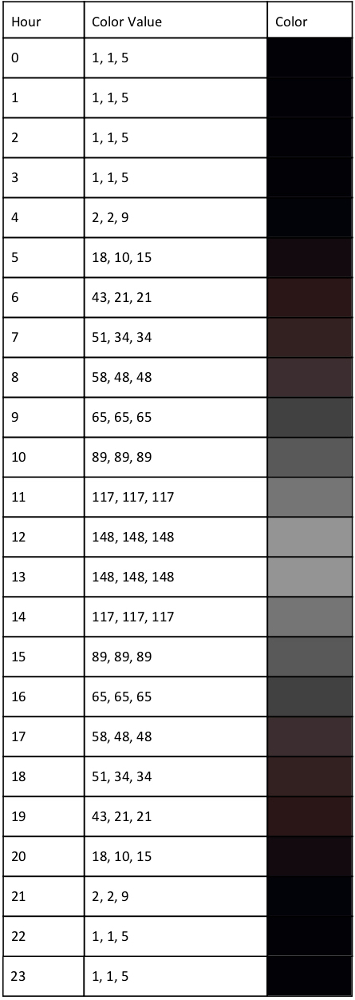
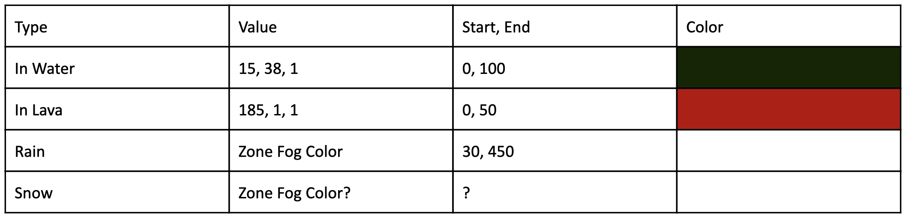

# Fog System and Clip Plane

EverQuest uses linear per vertex fog. Each zone has the option of using fog, sky or both together. Fog variables, included with other zone variables, are sent to the client each time you enter the zone. Variables that affect the fog include FogRed, FogGreen, FogBlue, FogStart, FogEnd, MinClip and MaxClip. When a zone does not use fog, the far plane defines the maximum distance from the camera that geometry is rendered. Beyond the far clip plane, the sky can be visible, or a solid color in non fog zones.  
****

_Nektulos with just fog \(left\) and fog and sky \(right\)_

### **Fog Color**

The fog color for each zone is mixed with a blend color that corresponds with in game time. As a result, the fog color in game will be significantly darker than the raw value sent to the client. The fog blend color mimics the ambient light hour values where during the sunset and sunrise the is a slight red tint and during nighttime, a very slight blue tint which allows the fog to better blend with the skydome visuals. These color values are consistent regardless if the zone uses a sky or not. 

To get the exact blend color, linearly interpolate between the value for the hour before and after the current time. Below is a listing of the blend color at each hour. To calculate the final color value that appears in the zone, you can use the formula below for each color component. For example:

**FinalFogRedValue = InterpolatedRedValueAtSpecifiedHour / 255 \* DatabaseRedValue**

There is also some fog color flickering \(noticeable while moving\) which seems to be unintentional and may be responsible for any slight variances in calculation.

### **Fog Distance and Clip Plane**

As EverQuest fog is calculated linearly, each zone that uses it has a fog start and end value. The fog start value is the distance at which fog will begin to affect the color of vertices and the end value denotes that anything equal or greater than this distance will be equal to the value of the fog color \(i.e. fog is at 100% density\). There are a handful of zones that do not use fog and anything past the far clip plane is not rendered.

Some zones like Firiona Vie have drastic differences between the min and max draw distance

The player is able to modify the game draw distance by changing the value of the “Clip Plane” slider. The client uses internal formulas to produce a fog start and end for each of the 21 levels of clip distance. I had incorrectly assumed that the client simply interpolated between FogMinClip and FogMaxClip and between MinClip and MaxClip to get the fog start and fog end values, respectively. It quickly became apparent that this was not the case and as there was no available information about how exactly the client used these values, I reverse engineered it using Cheat Engine. By finding the data offset for FogStart \(EQGfx\_Dx7.DLL+FBA24\) and FarClipPlane \(EQGfx\_Dx7.DLL+FBA28\)  and modifying the database zone appearance values, I was able to decipher how it works. Below is a table containing the formulas for the fog start and end \(far clip plane\) values. There are some exceptions and they are noted below.

<table>
  <thead>
    <tr>
      <th style="text-align:left"><b>Index</b>
      </th>
      <th style="text-align:left"><b>Fog Start</b>
      </th>
      <th style="text-align:left"><b>Fog End (Far Clip Plane)</b>
      </th>
    </tr>
  </thead>
  <tbody>
    <tr>
      <td style="text-align:left">0</td>
      <td style="text-align:left">(ClipMin - FogClipMax) * 1.0 + FogClipMin</td>
      <td style="text-align:left">
        
ClipMin + (FogClipMax - ClipMin) * 0

        
or

        
ClipMin

      </td>
    </tr>
    <tr>
      <td style="text-align:left">1</td>
      <td style="text-align:left">(ClipMin - FogClipMax) * 0.7 + FogClipMin</td>
      <td style="text-align:left">ClipMin + (FogClipMax - ClipMin) * 0.1</td>
    </tr>
    <tr>
      <td style="text-align:left">2</td>
      <td style="text-align:left">(ClipMin - FogClipMax) * 0.5 + FogClipMin</td>
      <td style="text-align:left">ClipMin + (FogClipMax - ClipMin) * 0.3</td>
    </tr>
    <tr>
      <td style="text-align:left">3</td>
      <td style="text-align:left">(ClipMin - FogClipMax) * 0.3 + FogClipMin</td>
      <td style="text-align:left">ClipMin + (FogClipMax - ClipMin) * 0.5</td>
    </tr>
    <tr>
      <td style="text-align:left">4</td>
      <td style="text-align:left">(ClipMin - FogClipMax) * 0.1 + FogClipMin</td>
      <td style="text-align:left">ClipMin + (FogClipMax - ClipMin) * 0.7</td>
    </tr>
    <tr>
      <td style="text-align:left">5</td>
      <td style="text-align:left">FogClipMin</td>
      <td style="text-align:left">
        
ClipMin + (FogClipMax - ClipMin) * 1.0

        
or

        
FogClipMax

      </td>
    </tr>
    <tr>
      <td style="text-align:left">6</td>
      <td style="text-align:left">(ClipMax - FogClipMax) * 0.066 + FogClipMin</td>
      <td style="text-align:left">FogClipMax + (ClipMax - FogClipMax) * 0.066</td>
    </tr>
    <tr>
      <td style="text-align:left">7</td>
      <td style="text-align:left">(ClipMax - FogClipMax) * 0.132 + FogClipMin</td>
      <td style="text-align:left">FogClipMax + (ClipMax - FogClipMax) * 0.132</td>
    </tr>
    <tr>
      <td style="text-align:left">8</td>
      <td style="text-align:left">(ClipMax - FogClipMax) * 0.198 + FogClipMin</td>
      <td style="text-align:left">FogClipMax + (ClipMax - FogClipMax) * 0.198</td>
    </tr>
    <tr>
      <td style="text-align:left">9</td>
      <td style="text-align:left">(ClipMax - FogClipMax) * 0.264 + FogClipMin</td>
      <td style="text-align:left">FogClipMax + (ClipMax - FogClipMax) * 0.264</td>
    </tr>
    <tr>
      <td style="text-align:left">10</td>
      <td style="text-align:left">(ClipMax - FogClipMax) * 0.333 + FogClipMin</td>
      <td style="text-align:left">FogClipMax + (ClipMax - FogClipMax) * 0.33</td>
    </tr>
    <tr>
      <td style="text-align:left">11</td>
      <td style="text-align:left">(ClipMax - FogClipMax ) * 0.396 + FogClipMin</td>
      <td style="text-align:left">FogClipMax + (ClipMax - FogClipMax) * 0.396</td>
    </tr>
    <tr>
      <td style="text-align:left">12</td>
      <td style="text-align:left">(ClipMax - FogClipMax) * 0.462 + FogClipMin</td>
      <td style="text-align:left">FogClipMax + (ClipMax - FogClipMax) * 0.462</td>
    </tr>
    <tr>
      <td style="text-align:left">13</td>
      <td style="text-align:left">(ClipMax - FogClipMax) * 0.528 + FogClipMin</td>
      <td style="text-align:left">FogClipMax + (ClipMax - FogClipMax) * 0.528</td>
    </tr>
    <tr>
      <td style="text-align:left">14</td>
      <td style="text-align:left">(ClipMax - FogClipMax) * 0.594 + FogClipMin</td>
      <td style="text-align:left">FogClipMax + (ClipMax - FogClipMax) * 0.594</td>
    </tr>
    <tr>
      <td style="text-align:left">15</td>
      <td style="text-align:left">(ClipMax - FogClipMax) * 0.666 + FogClipMin</td>
      <td style="text-align:left">FogClipMax + (ClipMax - FogClipMax) * 0.66</td>
    </tr>
    <tr>
      <td style="text-align:left">16</td>
      <td style="text-align:left">(ClipMax - FogClipMax) * 0.726 + FogClipMin</td>
      <td style="text-align:left">FogClipMax + (ClipMax - FogClipMax) * 0.726</td>
    </tr>
    <tr>
      <td style="text-align:left">17</td>
      <td style="text-align:left">(ClipMax - FogClipMax) * 0.792 + FogClipMin</td>
      <td style="text-align:left">FogClipMax + (ClipMax - FogClipMax) * 0.792</td>
    </tr>
    <tr>
      <td style="text-align:left">18</td>
      <td style="text-align:left">(ClipMax - FogClipMax) * 0.858 + FogClipMin</td>
      <td style="text-align:left">FogClipMax + (ClipMax - FogClipMax) * 0.858</td>
    </tr>
    <tr>
      <td style="text-align:left">19</td>
      <td style="text-align:left">(ClipMax - FogClipMax) * 0.924 + FogClipMin</td>
      <td style="text-align:left">FogClipMax + (ClipMax - FogClipMax) * 0.924</td>
    </tr>
    <tr>
      <td style="text-align:left">20</td>
      <td style="text-align:left">ClipMax - FogClipMax + FogClipMin</td>
      <td style="text-align:left">
        
FogClipMax + (ClipMax - FogClipMax) * 1.0

        
or

        
ClipMax

      </td>
    </tr>
  </tbody>
</table>**Notes:**

1. When MinFog == MaxFog, this table is not used. FogEnd begins at clip level 0 at ClipMin. At level 5, it is halfway between ClipMin and ClipMax. At level 20, it is at ClipMax. FogStart is always 100 units less than the fog end.
2. FogClipMin can never be lower than 30. 

It is important to note that even if the far plane is set to a very large number, you may see regions of the zone “pop in” as you move through it. This is due to EverQuest’s use of a PVS \(potentially visible set\) stored inside the zone BSP tree. When baking zone geometry, it is determined which zone regions can be seen from other zone regions based on many factors including distance and occlusion. During rendering, the PVS is used in the first pass of determining which regions to consider for drawing. If the region is not in the PVS of the camera’s region, it is discarded. The PVS data is baked directly into the zone files and there is no way around this limitation in the client.

### **Special Case Fog**

In some special cases, the fog color and distance values are overridden by game state. Below is a list of these cases. Note that these values were sampled from the client directly and therefore represent the blended, not raw, color values and that the start and end values are consistent across all clip settings:

_Information courtesy of Wizzel_

